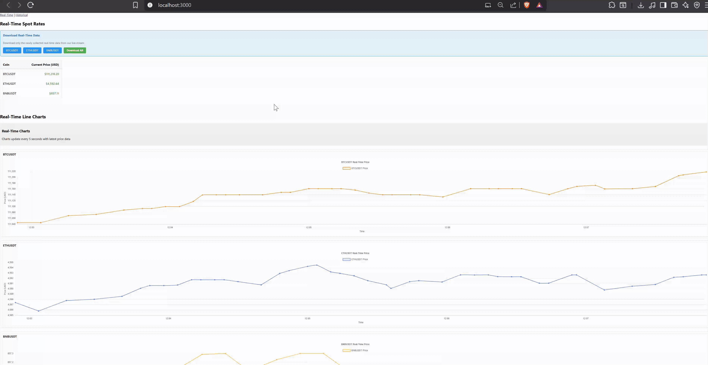
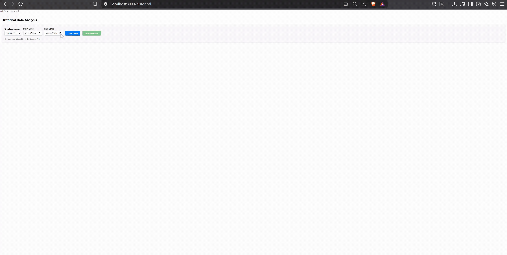

<h1 align="center">BeatCoins</h1>

  BeatCoins is a full-stack cryptocurrency dashboard that provides real-time and historical data visualization using Python (Flask) for the backend, SQL for the database, and React for the frontend.

<h2>📌 Table of Contents</h2>
<ul>
  <li><a href="#about">About</a></li>
  <li><a href="#features">Features</a></li>
  <li><a href="#installation">Installation</a></li>
  <li><a href="#usage">Usage</a></li>
  <li><a href="#screenshots">Screenshots</a></li>
</ul>

<h2 id="about">📖 About</h2>

BeatCoins is a web application that allows users to monitor cryptocurrency prices in real time, visualize historical trends, and download data for further analysis. The backend is built with Flask and SQL, fetching data from Binance, while the frontend is a modern React app for interactive charts and user experience.

<h2 id="features">✨ Features</h2>
<ul>
  <li>Real-time cryptocurrency price updates</li>
  <li>Historical data visualization with interactive charts</li>
  <li>Downloadable CSV data for custom analysis</li>
  <li>Modern, responsive frontend built with React</li>
  <li>RESTful API backend using Flask</li>
</ul>

<h2 id="installation">🛠️ Installation</h2>

<pre><code class="bash">
# Clone the repository
git clone https://github.com/yourusername/BeatCoins.git
cd BeatCoins

# Install backend dependencies and create virtual environment
make install-backend

# Install frontend dependencies
make install-frontend
</code></pre>

<em>Use the provided <code>Makefile</code> for easy setup of both backend and frontend environments.</em>

<h2 id="usage">👨‍💻 Usage</h2>

<pre><code class="bash">
# Start the backend server
make backend

# In a separate terminal, start the frontend
make frontend
</code></pre>

The backend will run on <code>http://localhost:5000</code> and the frontend on <code>http://localhost:3000</code>.

<h2 id="screenshots">🖼️ Screenshots</h2>

<!-- Add screenshots of your dashboard here -->
 
 

<em>
<b>Note:</b> Ensure you have Python 3 and Node.js installed on your system. For any issues, check the <code>requirements.txt</code> and <code>package.json</code> for dependencies.
</em>

